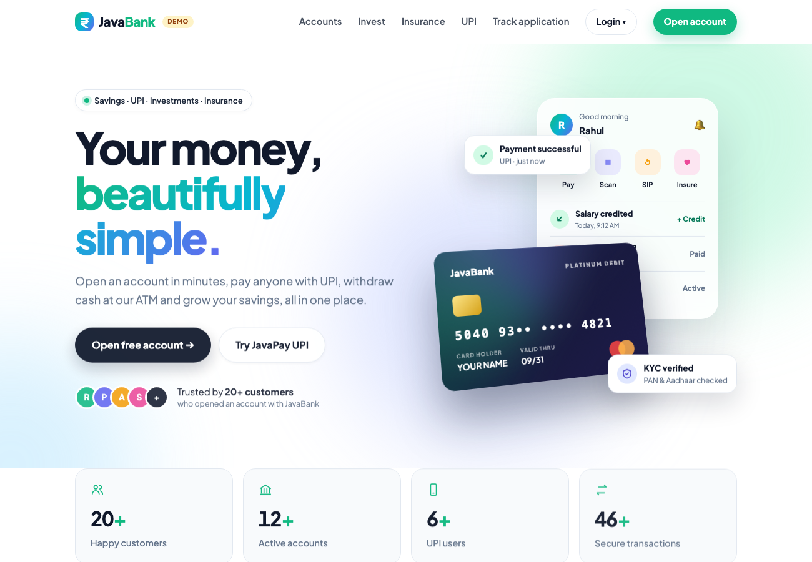
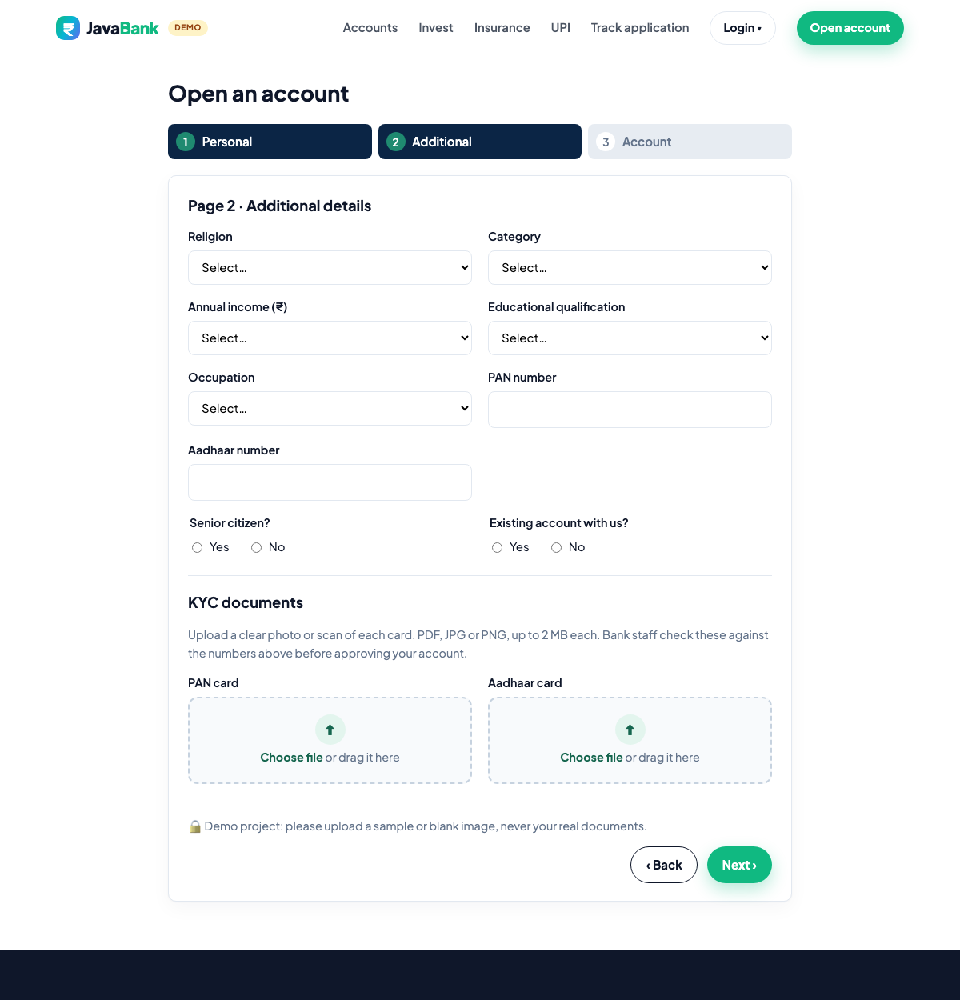
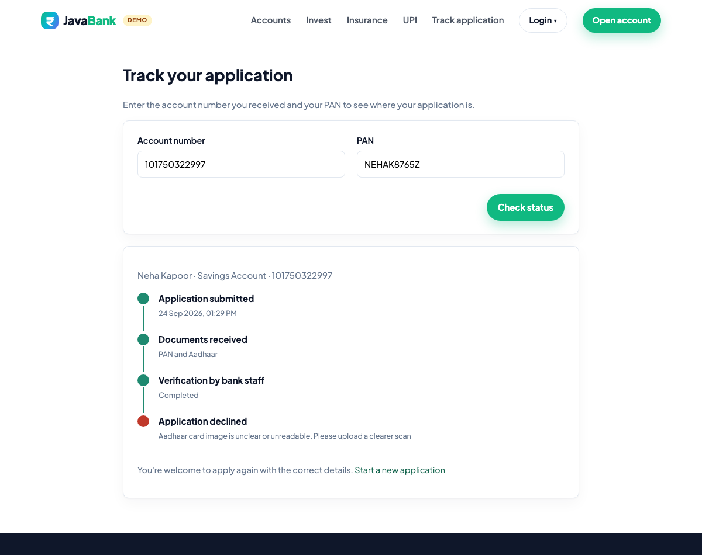
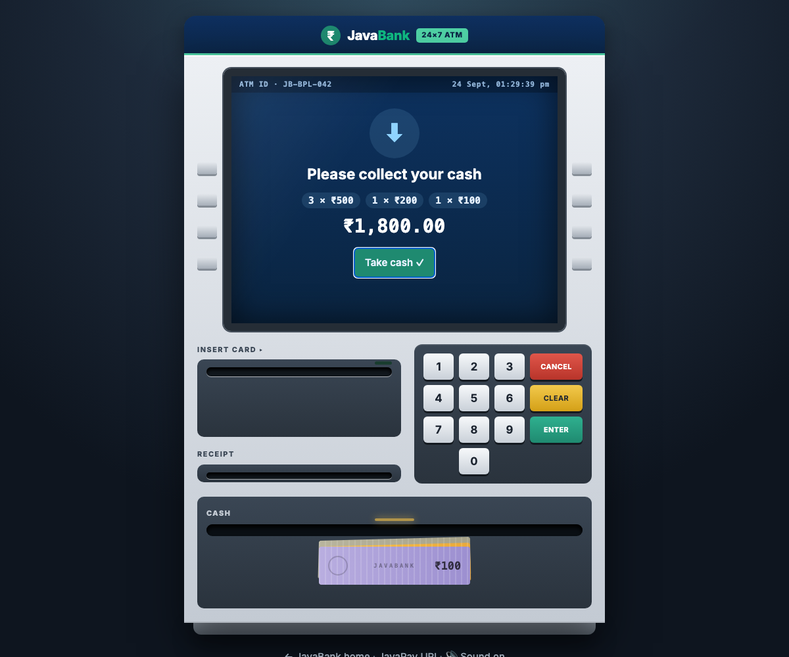
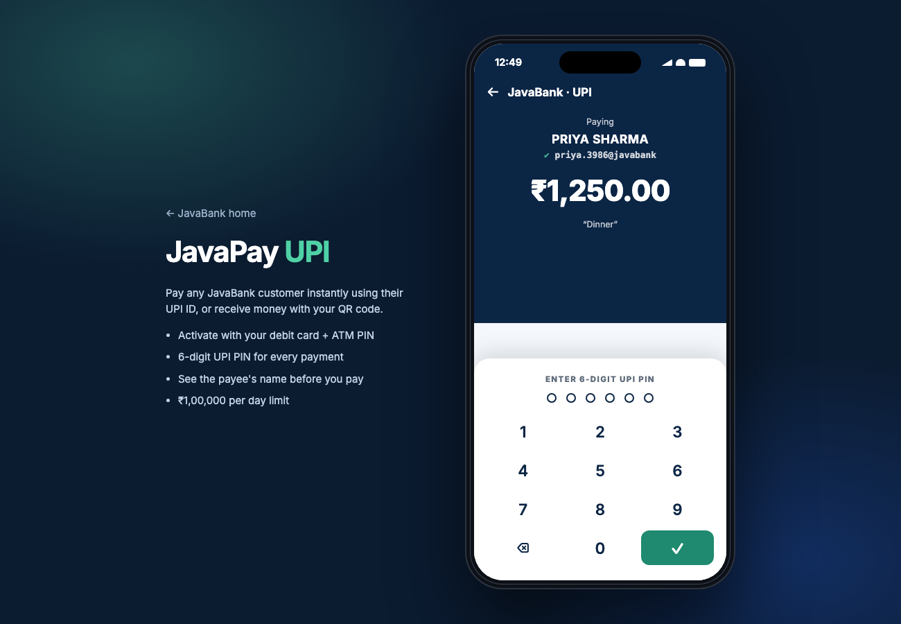
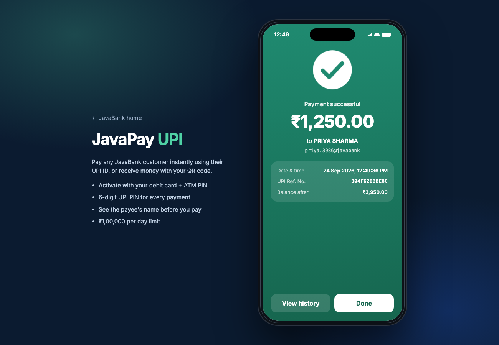
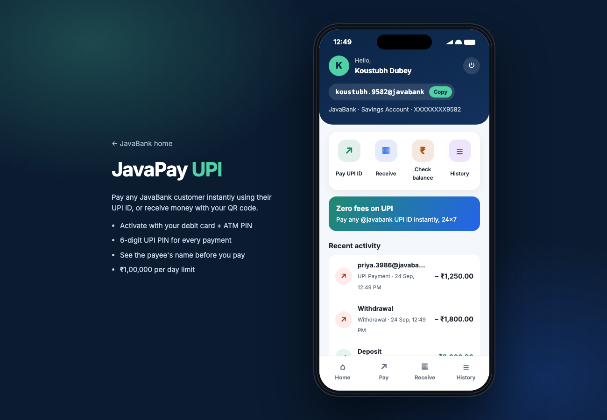
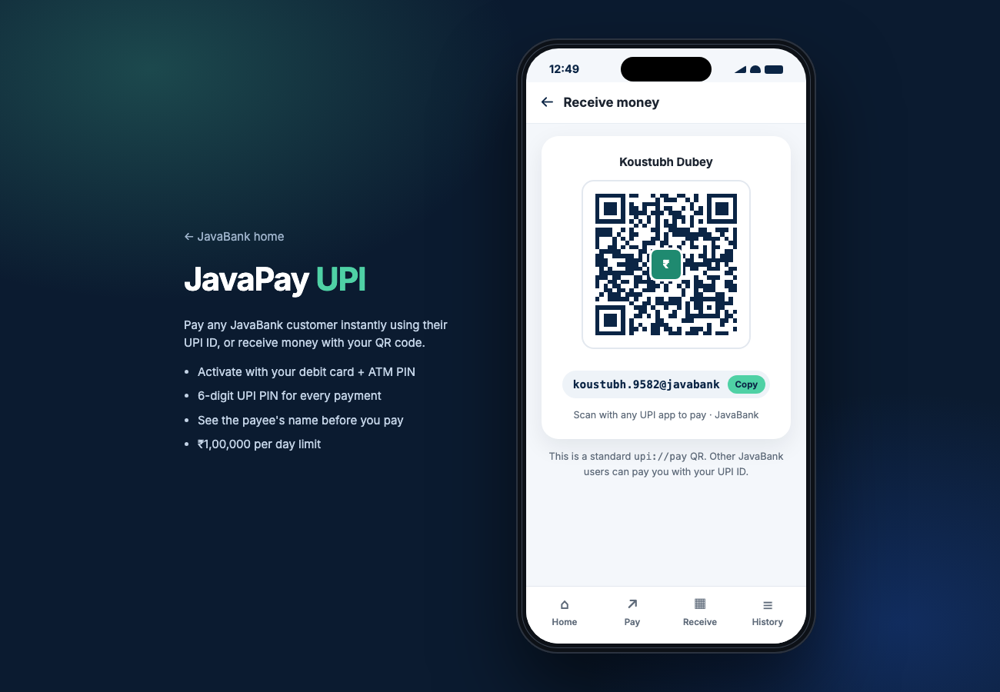
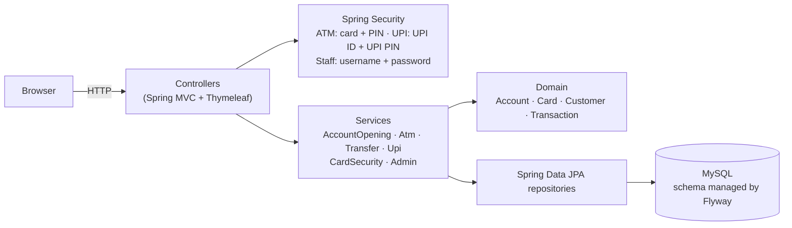

 # JavaBank: Bank Management System

A banking web application built with **Java 17, Spring Boot and MySQL**. Customers open an account online, withdraw
cash at a realistic web **ATM** (card insert, notes coming out of the cash slot, printed receipt), and pay each other
with **JavaPay UPI**, a phone-style UPI app with QR codes and a 6-digit UPI PIN. Bank staff approve and manage accounts
in an **admin panel**.

The project focuses on the correctness rules real banking software needs: exact money arithmetic, all-or-nothing
transfers, row locking under concurrent access, an append-only transaction ledger, and secure PIN handling.



## Features

**Account opening and KYC**
- 3-page application: personal details, KYC details (PAN, Aadhaar, income, occupation…), account type and services
- **Upload PAN and Aadhaar card images** (PDF, JPG or PNG, up to 2 MB, drag-and-drop with preview). The file type is
  checked from the file's first bytes, so a renamed HTML or script file is refused
- **Track application** page: enter the account number + PAN to see a live timeline (submitted → documents received →
  verification → active or declined, with the reason)
- Input validation (PAN format, 12-digit Aadhaar, 6-digit PIN code, email) and duplicate-PAN/Aadhaar checks
- Generates a 12-digit account number and a 16-digit card number with a valid **Luhn check digit**, plus a 4-digit PIN
  shown **once**
- New accounts start as **PENDING** until bank staff approve them

**ATM**
- Log in with card number + PIN on the ATM keypad; the card slides into the reader and is ejected on exit
- Deposit, cash withdrawal, fast cash, balance enquiry, mini statement (last 10), fund transfer, PIN change
- Cash is paid out in the fewest ₹500 / ₹200 / ₹100 notes, which animate out of the cash slot until you take them
- A receipt prints out of the receipt slot; working side buttons, keypad beeps (can be muted), live clock

**JavaPay UPI**
- Activate UPI with the debit card + ATM PIN and set a 6-digit UPI PIN (the same step resets a forgotten PIN)
- UPI ID generated from the name and account number, e.g. `priya.3311@javabank`
- Pay a UPI ID: the payee's registered name is shown before you enter the UPI PIN on an NPCI-style PIN pad
- Receive money with a standard `upi://pay` QR code, generated server-side as SVG with ZXing
- Balance check (needs the UPI PIN, like real apps), history, animated payment-success screen
- ₹1,00,000 per transaction and per day; UPI locks after 3 wrong UPI PINs

**Security and banking rules**
- ATM PINs, UPI PINs and staff passwords stored as **BCrypt hashes**; the plain PIN is never saved
- Card **blocked after 3 wrong PINs**; the counter resets after a successful login
- **₹25,000 daily withdrawal limit**; cash amounts must be multiples of ₹100
- Frozen or pending accounts cannot log in or transact
- CSRF protection on every form; separate login sessions for ATM, UPI and staff

**Home page**
- Modern landing page with live "Trusted by N+ customers" numbers from the database (no money totals are shown publicly)
- Investments section (mutual fund SIP, FD, digital gold, stocks) with a working **SIP / FD returns calculator**
- Insurance section (term life, health, motor, travel). Investment and insurance products are marked "coming soon"

**Staff (admin) panel**
- Dashboard: customers, pending/active/frozen accounts, transactions, total deposits
- Review the uploaded PAN and Aadhaar documents next to the customer's details
- **Approve or decline** applications (decline needs a reason, shown to the customer); freeze and unfreeze accounts;
  unblock cards; unlock UPI
- Customer KYC view (Aadhaar masked) and full transaction history

## Screenshots

| KYC document upload | Track application |
|---|---|
|  |  |

| ATM: collect your cash | ATM menu |
|---|---|
|  |  |

| UPI: enter UPI PIN | UPI: payment successful |
|---|---|
|  |  |

| UPI home | Receive with QR |
|---|---|
|  |  |

| Staff dashboard | Account details |
|---|---|
|  |  |

## Architecture



```
src/main/java/com/koustubh/bank
├── config/      Security (three login chains), app settings, admin user seeding
├── domain/      JPA entities with the business rules (Account.debit/credit, Card lockout)
├── repository/  Spring Data repositories, incl. SELECT … FOR UPDATE queries
├── service/     Banking use cases, each running in one database transaction
├── dto/         Form objects with Bean Validation
├── web/         Controllers for signup, ATM and admin pages
└── exception/   Business errors with customer-friendly messages
```

## Design decisions

| Problem | How it is handled |
|---|---|
| Floating-point rounding errors with money | All amounts are `BigDecimal` in Java and `DECIMAL(15,2)` in MySQL |
| Two withdrawals at the same moment overdrawing an account | The account row is locked with `SELECT … FOR UPDATE` (pessimistic lock) before the balance is checked. A test fires 20 concurrent withdrawals at a ₹1,000 balance and asserts exactly 10 succeed |
| A transfer debiting one account but failing to credit the other | Both updates and both ledger entries run in one `@Transactional` method, so either all are saved or none |
| Deadlock when A→B and B→A transfer at the same time | Both accounts are always locked in ascending id order; covered by a concurrent test |
| Losing the wrong-PIN count when login fails | `@Transactional(noRollbackFor = …)` keeps the failed-attempt update for both ATM and UPI PINs |
| One transfer engine for ATM and UPI | `TransferService.moveMoney` does the locking, debit/credit and both ledger legs; UPI adds its own PIN check and limits on top |
| Unsafe file uploads | KYC files are accepted only if their first bytes are a real PDF, PNG or JPEG signature, file names are cleaned, and staff downloads are sent with `X-Content-Type-Options: nosniff` |
| Paying out cash | `CashDispenser` picks the fewest notes (greedy works for 500/200/100); unit-tested for every amount |
| Audit trail | The `transactions` table is append-only; each row stores the balance after the operation, and both sides of a transfer share one reference id |
| Stolen database leaking PINs | PINs are BCrypt-hashed; Aadhaar is masked on screens |
| Schema changes | Versioned SQL migrations with Flyway; Hibernate only validates the schema |
| Testable "today" for daily limits | Time comes from an injected `Clock` in the bank's time zone (Asia/Kolkata) |

## Running locally

**Requirements:** Java 17+ and MySQL 8+ running on `localhost:3306`. Maven isn't needed; the included `./mvnw`
downloads it.

```bash
./mvnw spring-boot:run
```

Open <http://localhost:8080>. The `bankdb` database and its tables are created automatically on first start.

## Demo accounts (test data)

On first start the app loads 6 demo customers with **fixed** card numbers and PINs, so you can try every feature
without signing up. Each one is in a different state. They come from
[`DemoDataSeeder`](src/main/java/com/koustubh/bank/demo/DemoDataSeeder.java) and are loaded only once; set
`DEMO_DATA=false` to turn this off.

> These are fake test numbers for this demo only. Never use real card numbers, PINs or Aadhaar numbers.

**Bank staff (admin panel):** open <http://localhost:8080/admin/login> and log in as `admin` / `admin123`

**ATM** (<http://localhost:8080/atm/login>) and **JavaPay UPI** (<http://localhost:8080/upi/login>):

| Customer | Account no. | Card number | ATM PIN | UPI ID | UPI PIN | Balance | State: what to try |
|---|---|---|---|---|---|---|---|
| Rahul Sharma | `100000000001` | `5040930000000017` | `1234` | `rahul.0001@javabank` | `123456` | ₹42,350 | ✅ Active: ATM, UPI, everything |
| Priya Verma | `100000000002` | `5040930000000025` | `2345` | `priya.0002@javabank` | `234567` | ₹1,20,950 | ✅ Active current account: pay Rahul by UPI |
| Amit Patel | `100000000003` | `5040930000000033` | `3456` | — | — | ₹0 | ⏳ **Pending**: ATM refuses; approve or decline him in the admin panel |
| Sneha Iyer | `100000000004` | `5040930000000041` | `4567` | — | — | ₹20,000 | ❄️ **Frozen**: ATM refuses; unfreeze in the admin panel |
| Vikram Singh | `100000000005` | `5040930000000058` | `5678` | — | — | ₹15,000 | 🚫 **Card blocked** (3 wrong PINs): unblock in the admin panel |
| Anjali Gupta | `100000000006` | `5040930000000066` | `6789` | `anjali.0006@javabank` | `345678` | ₹7,700 | 🔒 **UPI locked**: unlock in the admin panel, or reset the UPI PIN with her card |

The demo data also includes real transaction history (deposits, withdrawals, an ATM transfer and UPI payments with
notes like "Dinner" and "Movie tickets"), so mini statements and UPI history aren't empty.

**Quick tour (5 minutes)**
1. **ATM:** log in as Rahul (`5040930000000017` / `1234`) → **Cash Withdrawal** → `1800`, and watch 3 × ₹500 + ₹200 + ₹100 come
   out of the cash slot. Then check **Mini Statement**.
2. **UPI:** log in to JavaPay as `rahul.0001@javabank` / `123456` → **Pay** → `priya.0002@javabank`, ₹500 → enter the UPI
   PIN. Open **Receive** to see Rahul's QR code.
3. **Security:** try Vikram's card: it's blocked. Try Amit's: it's waiting for approval.
4. **Staff:** log in as `admin` / `admin123`, approve Amit, unblock Vikram's card, unlock Anjali's UPI, unfreeze Sneha.
5. **Sign up with KYC:** open your own account with **Open account** and upload any sample image as the PAN and
   Aadhaar card (never real documents). As staff, open the application, view the documents and **decline** it with a
   reason. Then open **Track application** (account number + PAN) to see the reason.
6. **Home page:** try the SIP / FD calculator in the Investments section.

Tests check that every login in this table works (`DemoDataSeederTest`), so the table stays correct.

**Configuration** (environment variables)

| Variable | Default | Purpose |
|---|---|---|
| `DB_URL` | `jdbc:mysql://localhost:3306/bankdb?createDatabaseIfNotExist=true` | Database connection |
| `DB_USER` / `DB_PASSWORD` | `root` / *(empty)* | Database login |
| `ADMIN_USERNAME` / `ADMIN_PASSWORD` | `admin` / `admin123` | First staff login, created on startup. **Change this when deploying.** |
| `DEMO_DATA` | `true` | Load the demo customers above on first start |
| `PORT` | `8080` | HTTP port |

## Tests

```bash
./mvnw test
```

95 tests run against an in-memory H2 database with the real Flyway schema:
- **Domain unit tests:** balance rules, account states
- **Service tests:** daily limit, insufficient funds, transfer atomicity, concurrent withdrawals, transfer deadlock
  avoidance, PIN lockout and unblock, PIN change
- **UPI tests:** activation, UPI ID format, payment and narration, daily and per-transaction limits, wrong-PIN lock and
  reset, staff unlock
- **KYC tests:** file type detection from content, oversized and disguised files, file name cleaning, upload →
  staff view → decline → tracking page
- **Demo data tests:** every demo login, balance and account state in the table above
- **Web tests (MockMvc):** full 3-page signup, ATM login with a wrong PIN, withdrawal, staff approval, access control,
  UPI activate → login → pay → QR → balance → history

GitHub Actions runs the build and all tests on every push.

## Docker

```bash
docker build -t javabank .
docker run -p 8080:8080 -e DB_URL=... -e DB_USER=... -e DB_PASSWORD=... -e ADMIN_PASSWORD=... javabank
```

## Tech stack

Java 17 · Spring Boot 4 · Spring MVC · Spring Security · Spring Data JPA / Hibernate · Flyway · MySQL · Thymeleaf ·
Bean Validation · ZXing (QR codes) · vanilla JS + CSS animations · JUnit 5 · AssertJ · MockMvc · H2 · Docker ·
GitHub Actions

## History

This project started as a college Java Swing desktop app. The original version is in the git history (commit
`9910afb`). It was rebuilt as a Spring Boot web application with a layered architecture, tests and security.

*JavaBank is a demo project and not a real bank.*
