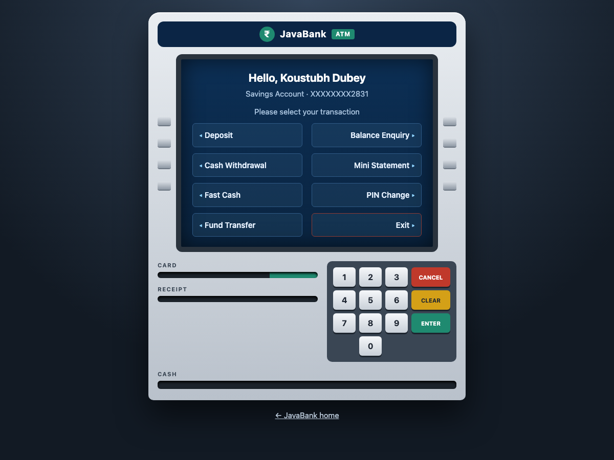
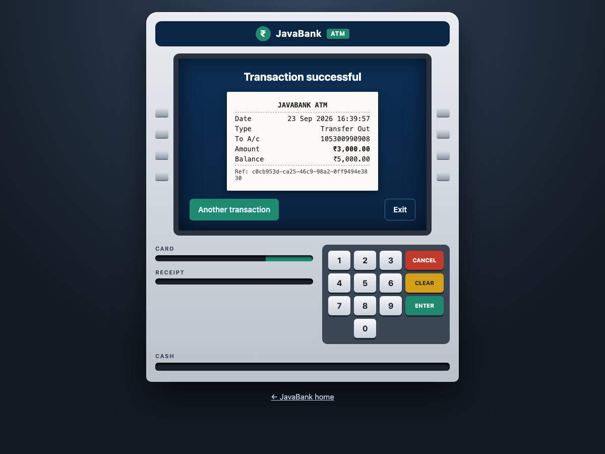
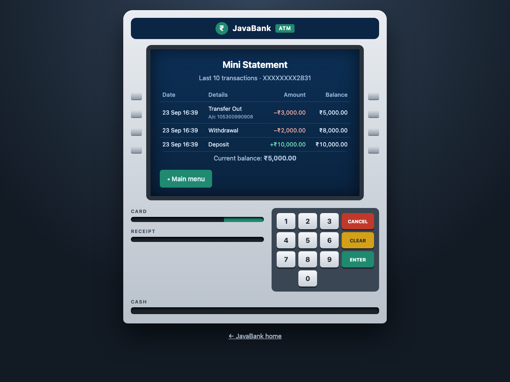
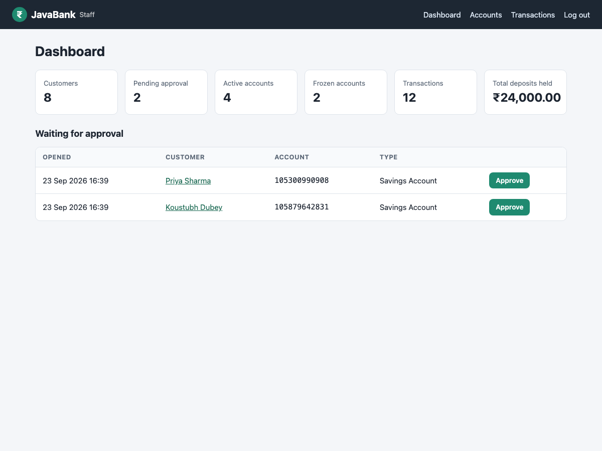
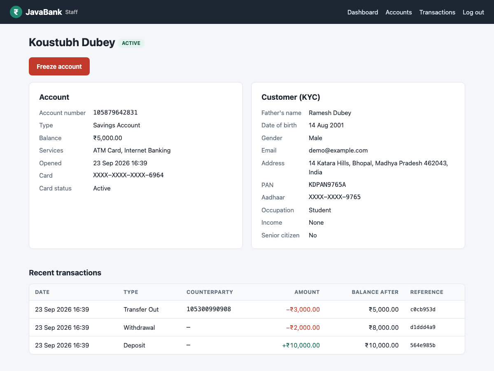
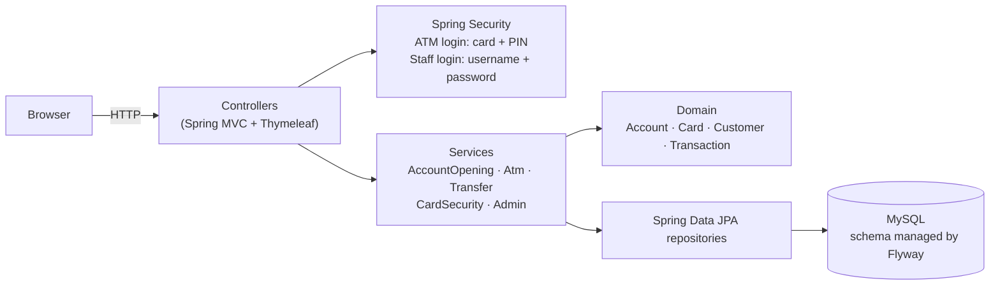

# JavaBank: Bank Management System

A banking web application built with **Java 17, Spring Boot and MySQL**. Customers open an account online, then use a
web **ATM** to deposit, withdraw, transfer money and more. Bank staff approve and manage accounts in an **admin panel**.

The project focuses on the correctness rules real banking software needs: exact money arithmetic, all-or-nothing
transfers, row locking under concurrent access, an append-only transaction ledger, and secure PIN handling.



## Features

**Account opening**
- 3-page application: personal details, KYC details (PAN, Aadhaar, income, occupation…), account type and services
- Input validation (PAN format, 12-digit Aadhaar, 6-digit PIN code, email) and duplicate-PAN/Aadhaar checks
- Generates a 12-digit account number and a 16-digit card number with a valid **Luhn check digit**, plus a 4-digit PIN
  shown **once**
- New accounts start as **PENDING** until bank staff approve them

**ATM**
- Log in with card number + PIN, using an on-screen ATM keypad
- Deposit, cash withdrawal, fast cash, balance enquiry, mini statement (last 10), fund transfer, PIN change
- Printed-style receipt with a transaction reference

**Security and banking rules**
- PINs and staff passwords stored as **BCrypt hashes**; the plain PIN is never saved
- Card **blocked after 3 wrong PINs**; the counter resets after a successful login
- **₹25,000 daily withdrawal limit**; cash amounts must be multiples of ₹100
- Frozen or pending accounts cannot log in or transact
- CSRF protection on every form; separate login sessions for customers and staff

**Staff (admin) panel**
- Dashboard: customers, pending/active/frozen accounts, transactions, total deposits
- Approve, freeze and unfreeze accounts; unblock cards
- Customer KYC view (Aadhaar masked) and full transaction history

## Screenshots

| ATM receipt | Mini statement |
|---|---|
|  |  |

| Staff dashboard | Account details |
|---|---|
|  |  |

## Architecture



```
src/main/java/com/koustubh/bank
├── config/      Security (two login chains), app settings, admin user seeding
├── domain/      JPA entities with the business rules (Account.debit/credit, Card lockout)
├── repository/  Spring Data repositories, incl. SELECT … FOR UPDATE queries
├── service/     Banking use cases, each running in one database transaction
├── dto/         Form objects with Bean Validation
├── web/         Controllers for signup, ATM and admin pages
└── exception/   Business errors with customer-friendly messages
```

## Design decisions

| Problem | How it is handled |
|---|---|
| Floating-point rounding errors with money | All amounts are `BigDecimal` in Java and `DECIMAL(15,2)` in MySQL |
| Two withdrawals at the same moment overdrawing an account | The account row is locked with `SELECT … FOR UPDATE` (pessimistic lock) before the balance is checked. A test fires 20 concurrent withdrawals at a ₹1,000 balance and asserts exactly 10 succeed |
| A transfer debiting one account but failing to credit the other | Both updates and both ledger entries run in one `@Transactional` method, so either all are saved or none |
| Deadlock when A→B and B→A transfer at the same time | Both accounts are always locked in ascending id order; covered by a concurrent test |
| Losing the wrong-PIN count when login fails | `@Transactional(noRollbackFor = AuthenticationException.class)` keeps the failed-attempt update |
| Audit trail | The `transactions` table is append-only; each row stores the balance after the operation, and both sides of a transfer share one reference id |
| Stolen database leaking PINs | PINs are BCrypt-hashed; Aadhaar is masked on screens |
| Schema changes | Versioned SQL migrations with Flyway; Hibernate only validates the schema |
| Testable "today" for daily limits | Time comes from an injected `Clock` in the bank's time zone (Asia/Kolkata) |

## Running locally

**Requirements:** Java 17+ and MySQL 8+ running on `localhost:3306`. Maven isn't needed; the included `./mvnw`
downloads it.

```bash
./mvnw spring-boot:run
```

Open <http://localhost:8080>. The `bankdb` database and its tables are created automatically on first start.

**Try it out**
1. Click **Open an account**, fill in the 3 pages and note the card number and PIN.
2. Go to **Staff** and log in with `admin` / `admin123`, then approve the account.
3. Go to **ATM**, log in with the card number and PIN, and deposit, withdraw or transfer money.

**Configuration** (environment variables)

| Variable | Default | Purpose |
|---|---|---|
| `DB_URL` | `jdbc:mysql://localhost:3306/bankdb?createDatabaseIfNotExist=true` | Database connection |
| `DB_USER` / `DB_PASSWORD` | `root` / *(empty)* | Database login |
| `ADMIN_USERNAME` / `ADMIN_PASSWORD` | `admin` / `admin123` | First staff login, created on startup. **Change this when deploying.** |
| `PORT` | `8080` | HTTP port |

## Tests

```bash
./mvnw test
```

69 tests run against an in-memory H2 database with the real Flyway schema:
- **Domain unit tests:** balance rules, account states
- **Service tests:** daily limit, insufficient funds, transfer atomicity, concurrent withdrawals, transfer deadlock
  avoidance, PIN lockout and unblock, PIN change
- **Web tests (MockMvc):** full 3-page signup, ATM login with a wrong PIN, withdrawal, staff approval, access control

GitHub Actions runs the build and all tests on every push.

## Docker

```bash
docker build -t javabank .
docker run -p 8080:8080 -e DB_URL=... -e DB_USER=... -e DB_PASSWORD=... -e ADMIN_PASSWORD=... javabank
```

## Tech stack

Java 17 · Spring Boot 4 · Spring MVC · Spring Security · Spring Data JPA / Hibernate · Flyway · MySQL · Thymeleaf ·
Bean Validation · JUnit 5 · AssertJ · MockMvc · H2 · Docker · GitHub Actions

## History

This project started as a college Java Swing desktop app. The original version is in the git history (commit
`9910afb`). It was rebuilt as a Spring Boot web application with a layered architecture, tests and security.

*JavaBank is a demo project and not a real bank.*
